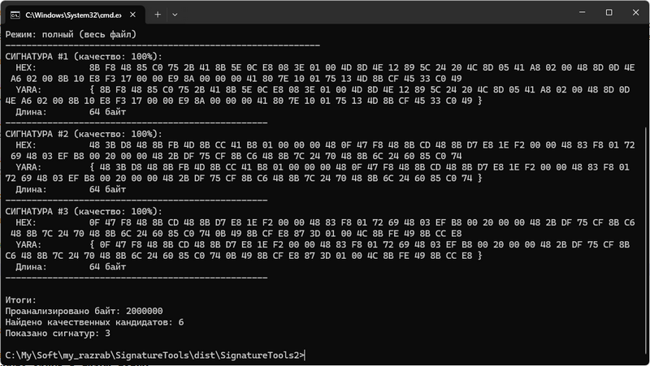

# ArtemSoft SignatureTools

Набор консольных утилит для работы с бинарными сигнатурами. Генерация сигнатур из файлов и поиск по этим сигнатурам в целях поиска троянов, вирусов и других зловредов.

## Назначение
Для автоматизированного снятия сигнатур со зловредных файлов (siggen.exe или sigmaker.exe) и последующий поиск зловредов по сигнатурам с помощью сканера (sighunter.exe).
Поиск файлов по сигнатурам, а не по контрольным суммам, позволяет находить модификации объектов и разные версии зловредов — даже если они были перепакованы или изменены.

## Состав пакета

### 1. siggen.exe - Генератор сигнатур
Анализирует файлы и создает уникальные бинарные последовательности для идентификации.

### 2. sigmaker.exe - Менеджер сигнатур (в разработке)
Утилита для управления базой сигнатур.

### 3. sighunter.exe - Поисковик сигнатур  
Ищет файлы, содержащие указанные бинарные сигнатуры.

## Простой пример использования

### 1. Снять сигнатуру со зловредного файла
```cmd
siggen.exe malware.exe
```



Допустим, будет найдено 6 качественных сигнатур, а на экран будет выведено 3 (по-умолчанию). 


## Быстрый старт

### Установка
1. Распакуйте архив в любую папку
2. Запускайте утилиты из командной строки

### Примеры использования

**Генерация сигнатур:**

```cmd
siggen.exe suspect_file.exe -l 64 -n 3 -o my_signatures.sigs
```


ыаваавыыа
ыва
пропр