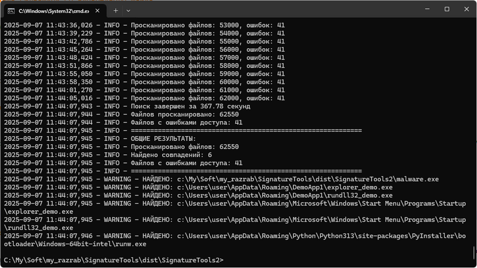

# ArtemSoft SignatureTools

Набор консольных утилит для работы с бинарными сигнатурами. Генерация сигнатур из файлов и поиск по этим сигнатурам в целях поиска троянов, вирусов и других зловредов.

## Назначение
Для автоматизированного снятия сигнатур со зловредных файлов (siggen.exe или sigmaker.exe) и последующий поиск зловредов по сигнатурам с помощью сканера (sighunter.exe).<br>
Поиск файлов по сигнатурам, а не по контрольным суммам, позволяет находить модификации объектов и разные версии зловредов — даже если они были перепакованы или изменены.

## Состав пакета

### 1. siggen.exe - Генератор сигнатур
Анализирует файлы и создает уникальные бинарные последовательности для идентификации.

### 2. sigmaker.exe - Генератор сигнатур (другой независимый вариант)
Утилита для управления базой сигнатур.

### 3. sighunter.exe - Поисковик сигнатур  
Ищет файлы, содержащие указанные бинарные сигнатуры.

## Простой пример использования

### 1. Снять сигнатуру со зловредного файла

```cmd
siggen.exe malware.exe
```


Допустим, будет найдено 6 качественных сигнатур в файле зловреда, а на экран будет выведено 3 (по-умолчанию). 
Копирую любую сигнатуру в буфер обмена, например "0F 47 F8 48 8B CD 48 8B D7 E8 1E F2 00 00 48 83 F8 01 72 69 48 03 EF B8 00 20 00 00 48 2B DF 75 CF 8B C6 48 8B 7C 24 70 48 8B 6C 24 60 85 C0 74 0B 49 8B CF E8 87 3D 01 00 4C 8B FE 49 8B CC E8".

### 2. Запустить сканер для поиска зловредов с такой сигнатурой

Запускаю сканер для поиска всех программных файлов на диске c:\ с такой же сигнатурой: 
```cmd
sighunter.exe c:\ -s "0F 47 F8 48 8B CD 48 8B D7 E8 1E F2 00 00 48 83 F8 01 72 69 48 03 EF B8 00 20 00 00 48 2B DF 75 CF 8B C6 48 8B 7C 24 70 48 8B 6C 24 60 85 C0 74 0B 49 8B CF E8 87 3D 01 00 4C 8B FE 49 8B CC E8"
```

После окончания проверки в консоль будет выведен список обнаруженных зловредов.



Также лог будет сохранен в папке logs.


## Еще один простой пример использования - создаем базу сигнатур

В первом примере дан самый примитив использования. А теперь переходим к накоплению сигнатур. Т.е. нужна какая-то база, в которую будем складывать сигнатуры, а сканер уже будет искать зловредные объекты по всей базе сигнатур. 
```cmd
SignatureTools2>siggen malware.exe -o base1.sigs --append
```
- 3 сигнатуры будут сняты с файла malware.exe и дописаны в базу base1.sigs

Файл base1.sigs:
```cmd
# Файл: malware.exe
# Размер: 8054064 байт
# Обработан: 2025-09-07 11:52:21
malware_sig1_64b|8B F8 48 85 C0 75 2B 41 8B 5E 0C E8 08 3E 01 00 4D 8D 4E 12 89 5C 24 20 4C 8D 05 41 A8 02 00 48 8D 0D 4E A6 02 00 8B 10 E8 F3 17 00 00 E9 8A 00 00 00 41 80 7E 10 01 75 13 4D 8B CF 45 33 C0 49|100%|64
malware_sig2_64b|48 3B D8 48 8B FB 4D 8B CC 41 B8 01 00 00 00 48 0F 47 F8 48 8B CD 48 8B D7 E8 1E F2 00 00 48 83 F8 01 72 69 48 03 EF B8 00 20 00 00 48 2B DF 75 CF 8B C6 48 8B 7C 24 70 48 8B 6C 24 60 85 C0 74|100%|64
malware_sig3_64b|0F 47 F8 48 8B CD 48 8B D7 E8 1E F2 00 00 48 83 F8 01 72 69 48 03 EF B8 00 20 00 00 48 2B DF 75 CF 8B C6 48 8B 7C 24 70 48 8B 6C 24 60 85 C0 74 0B 49 8B CF E8 87 3D 01 00 4C 8B FE 49 8B CC E8|100%|64
```
Три сигнатуры помогают проще разбираться в модификациях зловреда и ложных срабатываниях. Если при сканировании в каком-то файле будет 1 совпадение из 3, то можно предположить, что это ложное срабатывание или новая версия зловредной программы. Конечно, можно использоваться параметр `-n 1` для создания только одной сигнатуры.
Таким образом пополняем базу сигнатур `base1.sigs` образцами других зловредов, важно использовать параметор --append для дописывания сигнатур, а не перезаписи файла с сигнатурами. Конечно нужно организовать резервные копии баз.

Сканер только ищет объекты, ничего не удаляет. Есть мысль добавить возможность генерации AVZ-скрипта, например, для лечения зараженной системы. Если одобряете, то сообщите мне.

## Простой пример использования файла конфигурации

Чтобы сканер использовал файл конфигурации создайте в папке утилит файл sighunter_config.json 
```cmd
{
    "scan_extensions": [".exe", ".dll", ".sys", ".com", ".scr", ".ocx", ".cpl", ".drv", ".efi"],
    "scan_extensions_only": true,
    "max_file_size_mb": 500,
    "signature_files": [
        "custom_signatures.sigs"
    ],
    "default_signature_format": "hex"
}
```

- scan_extensions - фильтр по расширениям;
- scan_extensions_only - только эти расширения или все файлы;
- max_file_size_mb - защита от больших файлов;
- signature_files - список файлов с сигнатурами;
- default_signature_format - формат вывода (это косметическая настройка только для вывода в лог).

В данном примере при запуске утилиты без параметров:
```cmd
sighunter.exe c:\
```
будут просканированы файлы с расширениями ".exe", ".dll", ".sys", ".com", ".scr", ".ocx", ".cpl", ".drv", ".efi" на всем диске C:\ размом не более 500 мб, база сигнатур беретя из файла `custom_signatures.sigs`.

Думаю, что эти простые примеры дали вводное понятие назначения утилит. Теперь более подробно про каждую:

## SigGen.exe - Генератор сигнатур
Назначение: Создание уникальных сигнатур из бинарных файлов

Возможности:
- Умное определение смещения для анализа
- Автоматическое определение форматов файлов (PE, ELF, Mach-O)
- Оценка качества сигнатур по множеству критериев
- Фильтрация мусорных и низкокачественных последовательностей
- Поддержка различных форматов вывода (HEX, YARA, C-array, Python)

| Параметр          | Описание                     | Пример            |
| ----------------- | ---------------------------- | ----------------- |
| файл              | Анализируемый файл           | malware.exe       |
| -l, --length      | Длина сигнатуры (8-128)      | -l 24             |
| -n, --number      | Количество сигнатур          | -n 10             |
| --offset          | Смещение в файле             | --offset 1024     |
| --no-smart-offset | Не пропускать заголовки      | --no-smart-offset |
| --min-quality     | Минимальное качество (0-100) | --min-quality 70  |
| --show-quality    | Показать оценку качества     | --show-quality    |
| -o                | Сохранение в файл            | siggen.exe malware2.exe  <br> -o custom_signatures.sigs |
| --append          | Добавить результаты  <br>в существующий файл | siggen.exe malware2.exe -o  <br> custom_signatures.sigs --append |
| --fast-mode       | Быстрый анализ (500KB)       | siggen.exe malware.exe  <br>--fast-mode |

Если не указывать смещение, то будет автоматическое смещение (--offset 1024). <br>
Чем длиннее сигнатура, тем меньше ложных срабатываний. По-умолчанию: 64 байта.

### Критерии качества
Сигнатуры оцениваются по:
- Энтропия (идеально 4.0-6.5 бит)
- Разнообразие байтов (уникальность >80%)
- Отсутствие плохих паттернов (нули, повторения, ASCII)
- Присутствие валидных опкодов
- Выравнивание (кратность 4/8/16 байтам)


### Примеры:
```cmd
# Быстрый анализ (500KB)
siggen.exe malware.exe --fast-mode 

# Анализ с начала файла (включая заголовки):
siggen.exe malware.exe --no-smart-offset -l 16

# Анализ конкретной области файла:
siggen.exe malware.exe --offset 2048 -l 24 -n 5

# Анализ файла с выводом 10 сигнатур
siggen.exe malware.exe -n 10

# Низкое качество (больше сигнатур, но возможны ложные срабатывания)
siggen.exe malware.exe --min-quality 50

# Показать оценку качества для каждой сигнатуры
siggen.exe malware.exe --show-quality

# Быстрый анализ с короткими сигнатурами
siggen.exe malware.exe -l 12 -n 3 --min-quality 60

# Анализ конкретного участка файла
siggen.exe malware.exe --offset 4096 -l 16 -n 5

# Создать новый файл-базу сигнатур
siggen.exe malware.exe -o custom_signatures.sigs
(будет добавлено 5 сигнатур одного файла, чтобы была одна сигнатура используйте -n 1)

# Добавить в существующий файл-базу сигнатур
siggen.exe malware2.exe -o custom_signatures.sigs --append
```

### Формат .sigs файла
```cmd
# Автоматически сгенерированные сигнатуры
# Генератор: ArtemSoft SigMaker v1.0
# Время создания: 2024-01-15 14:30:25
# Формат: имя|сигнатура|описание
#==================================================

# Файл: malware1.exe
# Обработан: 2024-01-15 14:30:25
malware1_sig1|48 8B 05 DD CF 03 00 48 89 48 08|Качество: 85%
malware1_sig2|68 00 30 00 00 6A 14 8D 91 00 23|Качество: 82%
```

### Массовая обработка
```cmd
# Батник для обработки множества файлов
for %%i in (*.exe) do (
     siggen.exe "%%i" -n 3 -o all_signatures.sigs --append
)
Теперь можно легко создавать базы сигнатур для массового анализа!
```


## SigMaker.exe - Генератор сигнатур (тоже)
Назначение: Создание уникальных сигнатур из бинарных файлов

Возможности:
- возможности такие же, как и у `SigGen.exe`. Обе утилиты выполняют одну задачу, но немного разной реализацией. Для работы достаточной любой одной.

Основные возможности
- Извлечение блоков кода с высокой энтропией (уникальные сегменты).
- Пропуск начала файла (чтобы не брать загрузчики, одинаковые заголовки и т.п.).
- Создание мультисегментных сигнатур.
- Генерация YARA-правил или TXT-файлов для сканеров.
- Возможность указать собственное имя и описание сигнатур.
- Автоматическая подстановка имени файла как префикса (например cureit_1).

Использование
```cmd
sigmaker.exe <infile> <output> [опции]
```
Аргументы:
- infile — входной PE-файл (обязательный).
- output — выходной файл (обязательный).
Опции:
- --yara — сохранять результат в формате YARA.
- --txt — сохранять результат в формате TXT (name|signature|description).
- --name <prefix> — имя/префикс для TXT сигнатур (по умолчанию имя файла).
- --desc <text> — описание (например: Backdoor, Trojan, Packed).
- --blocks <N> — количество блоков для извлечения (по умолчанию 3).
- --entropy <E> — минимальная энтропия блока (по умолчанию 4.5).

### Примеры:
```cmd
# Создаст YARA-правило с именем sig_rule, включающее до 3 уникальных блоков
siggen.exe malware.exe --fast-mode

# Генерация TXT-сигнатур
sigmaker.exe sample.exe sample_sigs.txt --txt

Запишет в файл строки вида:
sample_1|AA BB CC ...| 
sample_2|11 22 33 ...| 
sample_3|FF EE DD ...| 

# TXT с кастомным именем и описанием
sigmaker.exe malware.exe sigs.txt --txt --name Trojan_X --desc "Backdoor.Win32"

Результат:
Trojan_X_1|AA BB CC ...|Backdoor.Win32
Trojan_X_2|11 22 33 ...|Backdoor.Win32
Trojan_X_3|FF EE DD ...|Backdoor.Win32

# YARA + TXT одновременно
sigmaker.exe virus.exe rules.yar --yara --txt --name MyVirus --desc "Test malware"

Будет создано:
•	rules.yar с YARA-правилом.
•	rules.yar (дополненный TXT-сигнатурами в конце файла).

# Извлечение большего числа блоков
sigmaker.exe packed.exe sigs.txt --txt --blocks 5 --entropy 5.0
Извлечёт до 5 блоков, каждый с энтропией ≥ 5.0.
```

### Форматы выходных файлов
TXT
```cmd
<name>_<id>|<hex signature>|<description>
```
YARA
```cmd
rule sig_rule {
    strings:
        $pattern1 = { AA BB CC ... }
        $pattern2 = { 11 22 33 ... }
    condition:
        any of them
}
```

### Рекомендации
- Для упрощения можно запускать с --txt, чтобы быстро набирать базу сигнатур.
- Если планируется использовать в YARA-сканерах — добавляйте --yara.
- Лучше указывать --name и --desc для наглядности.


##  SigHunter.exe - Поисковик по сигнатурам
Назначение: Поиск файлов по бинарным сигнатурам

Возможности:
- Подробное логирование результатов
- Звуковое оповещение о результатах


## Быстрый старт

### Установка
1. Распакуйте архив в любую папку
2. Запускайте утилиты из командной строки

### Примеры использования

**Генерация сигнатур:**

```cmd
siggen.exe suspect_file.exe -l 64 -n 3 -o my_signatures.sigs
```


ыаваавыыа
ыва
пропр